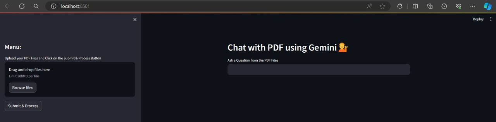
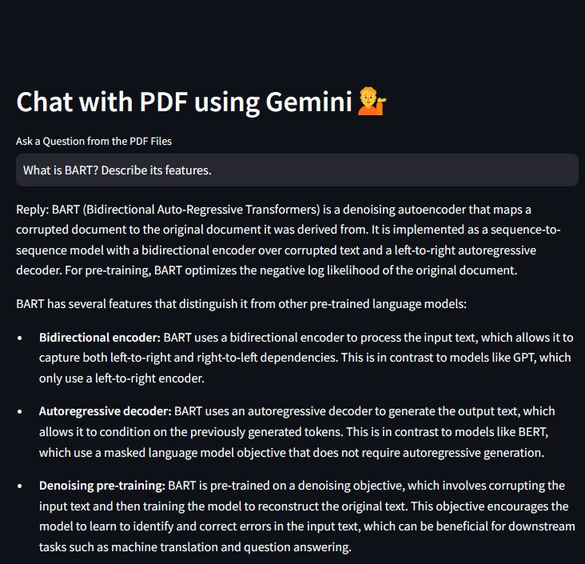
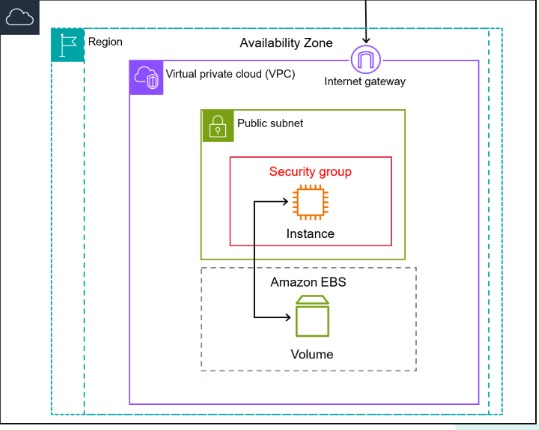

# RAG-based Chatbot on AWS EC2

# Overview

This repository contains the code for a RAG (Retrieval Augmented Generation) based chatbot deployed on AWS EC2. The chatbot utilizes Streamlit for the user interface and integrates natural language processing libraries such as Google Generative AI for text extraction from PDFs and conversational responses. Users can upload PDF documents, ask questions, and receive real-time answers through natural language interaction.

# Features

**Text Extraction**: Utilizes PyPDF2 library to extract text content from uploaded PDF files.

**Vector Embeddings:** Converts text chunks into vector embeddings using Google Generative AI model for efficient analysis and similarity search.

**Conversational AI:** Sets up conversational question-answering chain to provide contextual responses to user queries.

**User Interface:** Built using Streamlit to provide an intuitive platform for interaction.

**Deployment on AWS EC2:** Ensures scalability, reliability, and accessibility of the chatbot.

# Model Used for the Chatbot

The chatbot implements various functionalities including text extraction, chunk segmentation, vector embeddings generation, conversational question-answering chain setup, and UI building.

# Deploying Chatbot on AWS EC2 Instance

The deployment process involves setting up an EC2 instance with specified technical specifications including names and tags, AMI selection, instance type, key pair login files, and network settings. Deploying on EC2 offers advantages such as scalability, customization, and reliability.

# Results
The chatbot has been successfully built and deployed on AWS EC2, providing users with an intuitive platform for interacting with PDF documents. The deployment process was smooth, and the chatbot is accessible via the provided external URL.

# Conclusion
The project aims to empower users to extract insights from PDF documents through natural language interaction. The integration of advanced NLP libraries and deployment on AWS EC2 ensures a robust and scalable platform for users.

# Acknowledgement
Special thanks to Dr. Animesh Chaturvedi for providing the opportunity to work on this project and for guidance on utilizing Google Generative AI and AWS services.

# Our Team
Devapangu Abhishek (**21bds016**)

Hosur Sai Kartik (**21bds021**)

Nischay Kondai (**21bds045**)

Pratik Raj (**21bds047**)
